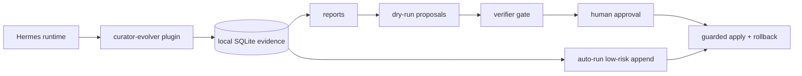

<div align="center">

# 🧬 Hermes Curator Evolver

<h3>Make Hermes skills improve from real usage — with evidence, review, and rollback.</h3>

<p>
  <b>Inspired by <a href="https://github.com/AMAP-ML/SkillClaw">SkillClaw</a></b>, adapted for Hermes Agent as a local-first plugin:<br/>
  session evidence in, safer skill updates out.
</p>

[](https://github.com/NousResearch/hermes-agent)
[](https://github.com/AMAP-ML/SkillClaw)
[](https://github.com/pingchesu/hermes-curator-evolver)
[](https://github.com/pingchesu/hermes-curator-evolver)
[](https://www.python.org/)
[](https://www.sqlite.org/)
[](#safety-model)
[](./LICENSE)

| 📚 Session evidence | 📥 Backfill today | 🧠 Optional semantic search | 🛡️ Guarded automation |
|:-:|:-:|:-:|:-:|
| Learn from real Hermes work | Import old `session_*.json` history | Embedding + rerank only when selected | Append-only notes, backups, rollback |

</div>

---

## Contents

- [Quick start: install, backfill, autorun](#quick-start-install-backfill-autorun)
- [What you get](#what-you-get)
- [Why this exists](#why-this-exists)
- [Inspired by SkillClaw, made Hermes-native](#inspired-by-skillclaw-made-hermes-native)
- [Architecture](#architecture)
- [Model usage plan](#model-usage-plan)
- [Safety model](#safety-model)
- [CLI reference](#cli-reference)
- [Contributing](#contributing)
- [Uninstall](#uninstall)

## Quick start: install, backfill, autorun

Copy, paste, done. Default mode is model-free and deterministic.

```bash
hermes plugins install pingchesu/hermes-curator-evolver --enable
uv pip install --python ~/.hermes/hermes-agent/venv/bin/python -e ~/.hermes/plugins/curator-evolver
hermes-curator-evolver backfill-sessions --sessions-dir ~/.hermes/sessions --days 30 --format json
hermes-curator-evolver install-auto --schedule daily --enable
hermes gateway restart
```

That installs the plugin, imports your recent Hermes history, and enables a daily user-level timer that appends low-risk evidence notes only to **local agent-created** skills. Official/bundled skills, hub-installed skills, plugin-provided skills, and anything from `skills.external_dirs` are still analyzed, but skipped for unattended writes.

Want smarter candidate ordering for larger or multilingual skill libraries?

```bash
uv pip install --python ~/.hermes/hermes-agent/venv/bin/python -e "$HOME/.hermes/plugins/curator-evolver[semantic]"
hermes-curator-evolver install-auto --schedule daily --enable --semantic-candidates --rerank-candidates
```

Semantic mode is still conservative: embeddings/rerankers only reorder candidates that already passed evidence thresholds. They do not write content by themselves, and the provenance gate still allows unattended writes only to local agent-created skills.

Useful one-liners:

```bash
hermes-curator-evolver status
hermes-curator-evolver auto-run --skills-dir ~/.hermes/skills --format json  # dry-run preview
hermes-curator-evolver uninstall-auto                                       # stop automation
```

Notes:

- Hermes currently clones the plugin to `~/.hermes/plugins/curator-evolver`, but general plugin CLI commands are not auto-installed yet. The `uv pip install ... -e` line is intentionally part of the quick start.
- Existing sessions are not automatically imported by runtime hooks. Run `backfill-sessions` once if you already have Hermes history.
- For health checks, timer logs, model details, and uninstall steps, see [docs/after-install.md](docs/after-install.md).

## What you get

| Need | What happens |
| --- | --- |
| **My skills should learn from real work** | Hermes tool calls, skill events, sessions, and backfilled transcripts become local SQLite evidence. |
| **I want it to feel automatic** | `install-auto --enable` creates a daily autorun timer. No daily command to remember. |
| **I have lots of old sessions** | `backfill-sessions` turns existing `session_*.json` files into usable evidence immediately. |
| **I want better matching** | Optional Qwen embeddings + bge reranking can improve candidate ordering. |
| **I do not want scary rewrites** | Autorun writes append-only managed notes, skips pinned skills, skips official/bundled, hub-installed, plugin-provided, and `external_dirs` skills, and records backup/rollback manifests. |

## Why this exists

Hermes skills are operational memory. They capture how an agent should debug, deploy, research, and communicate in a real environment. But memory decays: stale commands, duplicated workflows, missing caveats, weak trigger descriptions, and hard-won lessons trapped in old session logs.

**Hermes Curator Evolver** closes that loop: session evidence in, safer skill updates out — without patching Hermes core or silently rewriting your skill library.

## Inspired by SkillClaw, made Hermes-native

[SkillClaw](https://github.com/AMAP-ML/SkillClaw) showed the right idea: agents should evolve skills from session trajectories. Hermes Curator Evolver adapts that idea to a local-first Hermes plugin.

| SkillClaw lesson | Hermes-native adaptation |
| --- | --- |
| Learn from sessions. | Runtime hooks + historical backfill feed local SQLite evidence. |
| Retrieve similar skills before editing. | Lexical search by default; optional Qwen embeddings + bge reranking. |
| Verify skill changes. | Dry-run proposals, verifier gates, exact SHA match, backups, rollback. |
| Avoid uncontrolled mutation. | No Hermes core patches, pinned skills are skipped, official/hub/external/plugin skills are protected from unattended writes, autorun is append-only. |

## Architecture

See [docs/architecture.md](docs/architecture.md) for the one-page architecture diagram, model usage plan, and safety boundary. See [docs/after-install.md](docs/after-install.md) for the post-install autorun guide, health checks, uninstall path, and supported models.



## Model usage plan

| Phase | Model | Purpose | Default |
| --- | --- | --- | --- |
| v0.1 | None | Evidence collection and report aggregation. | Local/read-only. |
| v0.2 | Hermes configured chat model | Draft improvement proposals from evidence + skill text. | Optional `--draft-with-model`; dry-run artifact; no skill writes. |
| v0.2 | Deterministic verifier + future verifier prompt | Check grounding, safety, and non-destructive behavior. | Blocks mutation by default. |
| v0.3/v0.5 | `Qwen/Qwen3-Embedding-0.6B` | Candidate skill/evidence/user-correction search. | Optional `--execute-semantic`; no default download. |
| v0.3/v0.5 | `BAAI/bge-reranker-v2-m3` | Re-rank candidates, especially for mixed Chinese/English agent workflows. | Optional `--rerank`; no default download. |
| v0.4 | Verifier + local validation command | Guard final reviewed content before apply. | Requires approval, backup, verification, rollback. |
| v0.6 | None by default | Automatic low-risk append-only skill updates from observed evidence. | Optional `install-auto`; no Hermes core modification. |
| v0.7 | `Qwen/Qwen3-Embedding-0.6B` + `BAAI/bge-reranker-v2-m3` | Optional model-assisted autorun candidate ordering. | Explicit `--semantic-candidates --rerank-candidates`; models only reorder evidence-eligible candidates. |
| v0.9 | None | Provenance-safe unattended auto-apply. | Writes only local agent-created skills; skips bundled, hub, plugin, external, pinned, and unknown sources. |

## Safety model

The guarded path requires:

1. evidence report,
2. dry-run proposal,
3. verifier pass,
4. human-reviewed content,
5. exact target SHA256 match,
6. explicit `--approve`,
7. backup manifest,
8. optional validation command,
9. rollback path.

Hard defaults:

- ✅ Evidence/report/proposal/candidate commands do not mutate skills.
- ✅ Semantic mode does not download models by default; `--execute-semantic` / `--rerank` are explicit opt-ins.
- ✅ Apply refuses to run without `--approve`.
- ✅ Apply refuses if the target SHA256 changed.
- ✅ Apply creates a backup before writing.
- ✅ Failed validation auto-restores the backup.
- ✅ `auto-run` writes only managed append-only blocks and still requires both `--apply-low-risk` and `--approve-auto-apply` before mutation.
- ✅ Even with both write flags, unattended auto-apply writes only local agent-created skills. Official/bundled skills (`.bundled_manifest`), hub-installed skills (`.hub/lock.json`), plugin-provided skills, `skills.external_dirs`, pinned skills, and unknown sources are skipped.
- ✅ `--semantic-candidates` / `--rerank-candidates` are explicit opt-ins and only reorder skills that already passed the evidence threshold.

## CLI reference

```bash
# Evidence
hermes-curator-evolver status
hermes-curator-evolver report --days 7 --format json
hermes-curator-evolver backfill-sessions --sessions-dir ~/.hermes/sessions --days 30 --format json
hermes-curator-evolver analyze --skill hermes-agent --days 30

# Proposal + verifier
hermes-curator-evolver propose --skill hermes-agent --skill-file ./SKILL.md --format json --output proposal.json
hermes-curator-evolver propose --skill hermes-agent --skill-file ./SKILL.md --draft-with-model --model-timeout 180
hermes-curator-evolver verify --proposal-file proposal.json --skill hermes-agent --format json

# Candidate generation
hermes-curator-evolver candidates --query "gateway restart plugin cli" --skills-dir ~/.hermes/skills
hermes-curator-evolver candidates --query "中文 mixed agent skill" --skills-dir ~/.hermes/skills --semantic --format json       # plan only
hermes-curator-evolver candidates --query "中文 mixed agent skill" --skills-dir ~/.hermes/skills --execute-semantic --format json
hermes-curator-evolver candidates --query "中文 mixed agent skill" --skills-dir ~/.hermes/skills --execute-semantic --rerank --format json

# Guarded apply
sha256sum ./SKILL.md
hermes-curator-evolver apply \
  --target ./SKILL.md \
  --content-file ./reviewed-SKILL.md \
  --expected-sha256 <current-sha256> \
  --backup-dir .curator-evolver-backups \
  --verify-command "python -m pytest -q" \
  --approve

# Rollback
hermes-curator-evolver rollback --manifest .curator-evolver-backups/<timestamp>/manifest.json

# Automatic evolution
hermes-curator-evolver auto-run --skills-dir ~/.hermes/skills --format json                  # dry-run
hermes-curator-evolver auto-run --skills-dir ~/.hermes/skills --semantic-candidates --rerank-candidates --format json
hermes-curator-evolver auto-run --skills-dir ~/.hermes/skills --apply-low-risk --approve-auto-apply
hermes-curator-evolver auto-run --skills-dir ~/.hermes/skills --semantic-candidates --rerank-candidates --apply-low-risk --approve-auto-apply
hermes-curator-evolver auto-run --skills-dir ~/.hermes/skills --apply-low-risk --approve-auto-apply --block-auto-apply-skill 'github-*'
hermes-curator-evolver auto-run --skills-dir ~/.hermes/skills --apply-low-risk --approve-auto-apply --allow-auto-apply-skill store-playbook  # only within local agent-created source boundary
hermes-curator-evolver install-auto --schedule daily --enable
hermes-curator-evolver install-auto --schedule daily --enable --semantic-candidates --rerank-candidates
hermes-curator-evolver uninstall-auto
```

## Contributing

Contributions are welcome. See [CONTRIBUTING.md](CONTRIBUTING.md) for local setup, TDD expectations, PR checklist, smoke tests, and CI behavior.

## Credits and inspiration

**Inspired by [SkillClaw](https://github.com/AMAP-ML/SkillClaw)** — especially the idea that agent skills should evolve from real session evidence, not only from hand-written maintenance. Hermes Curator Evolver keeps that inspiration, but applies it through Hermes-native plugin hooks, local SQLite evidence, explicit model opt-ins, and conservative guarded writes.

## Uninstall

Hermes already provides plugin removal:

```bash
hermes plugins disable curator-evolver
hermes plugins uninstall curator-evolver   # alias: remove/rm
```

If you enabled the optional auto-evolve timer, remove it first:

```bash
hermes-curator-evolver uninstall-auto
```

Plugin removal does not delete historical evidence by default. Remove it manually only if you want a clean slate:

```bash
rm -rf ~/.hermes/plugins/curator-evolver/data ~/.hermes/plugins/curator-evolver/backups
```

## Agent tool

When enabled, Hermes can call:

```text
curator_evidence_report
```

to retrieve a JSON evidence report.

## Install from source

```bash
git clone https://github.com/pingchesu/hermes-curator-evolver.git
cd hermes-curator-evolver
python -m pip install -e .
hermes plugins enable curator-evolver
```

If your Hermes environment does not provide `pip`, use:

```bash
uv pip install -e .
```

## Directory-plugin install

You can also symlink this repository into the Hermes plugin directory:

```bash
mkdir -p ~/.hermes/plugins
ln -s /path/to/hermes-curator-evolver ~/.hermes/plugins/curator-evolver
hermes plugins enable curator-evolver
```

## Data location

Default:

```text
~/.hermes/plugins/curator-evolver/data/evidence.sqlite
```

Override:

```bash
export HERMES_CURATOR_EVOLVER_DB=/custom/path.sqlite
```

## Roadmap status

- ✅ **v0.1** — evidence/report plugin.
- ✅ **v0.2** — proposal generation + verifier gate, dry-run by default.
- ✅ **v0.3** — candidate generation interface with optional embedding/reranker model plan.
- ✅ **v0.4** — guarded apply with explicit approval, backup, verification, and rollback.
- ✅ **v0.5** — explicit model execution paths: Hermes chat-model drafts, Qwen embedding candidate ranking, and bge reranking.
- ✅ **v0.6** — plug-and-play `auto-run` + optional systemd timer for low-risk append-only skill improvements without Hermes core changes.
- ✅ **v0.7** — explicit `--semantic-candidates` / `--rerank-candidates` for model-assisted autorun candidate ordering.
- ✅ **v0.8** — `backfill-sessions` for existing Hermes history, `CONTRIBUTING.md`, and GitHub Actions CI.
- ✅ **v0.9** — provenance-safe autorun: only local agent-created skills can be auto-applied; bundled, hub, plugin, external, pinned, and unknown sources are skipped.

---

<div align="center">

Built for people who want agent skills to improve — without letting automation silently rewrite the library.

</div>
