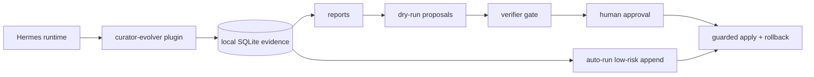

<div align="center">

# 🧬 Hermes Curator Evolver

<h3>Evidence-driven skill evolution for Hermes Agent — evidence first, proposals second, guarded apply last.</h3>

[](https://github.com/NousResearch/hermes-agent)
[](https://github.com/pingchesu/hermes-curator-evolver)
[](https://github.com/pingchesu/hermes-curator-evolver)
[](https://www.python.org/)
[](https://www.sqlite.org/)
[](#safety-model)
[](./LICENSE)

| 🔎 Evidence first | 🧠 Model-aware roadmap | 🛡️ Guarded apply | 🔌 Hermes plugin |
|:-:|:-:|:-:|:-:|
| Learn from real sessions | Use chat/embedding/rerankers only where useful | Approval + backup + verify + rollback | Tools, hooks, slash command, CLI |

</div>

---

## Why this exists

Hermes skills are powerful, but a growing skill library can become noisy: stale instructions, duplicated workflows, missing caveats, and hard-to-find lessons from past sessions.

**Hermes Curator Evolver** is a conservative companion to the official `hermes curator`. It turns local evidence into reviewable proposals, then only applies reviewed content through guardrails.

> The default loop is still safe: report → proposal → verifier → human approval → guarded apply.

## What it does

<table>
<tr>
<td>📡 <b>Observe</b></td>
<td>Hooks into Hermes runtime signals such as tool calls, skill usage, and session lifecycle events.</td>
</tr>
<tr>
<td>🗄️ <b>Store</b></td>
<td>Keeps compact local evidence in SQLite at <code>~/.hermes/plugins/curator-evolver/data/evidence.sqlite</code>.</td>
</tr>
<tr>
<td>📥 <b>Backfill</b></td>
<td>Imports existing Hermes <code>session_*.json</code> transcripts so users with prior history can get useful evidence immediately.</td>
</tr>
<tr>
<td>📊 <b>Report</b></td>
<td>Generates markdown or JSON reports for skill governance review.</td>
</tr>
<tr>
<td>📝 <b>Propose</b></td>
<td>Builds dry-run, evidence-grounded proposal artifacts. No files are changed by proposal generation.</td>
</tr>
<tr>
<td>🔍 <b>Find candidates</b></td>
<td>Provides dependency-free lexical candidate search, semantic embedding execution on request, and optional reranking.</td>
</tr>
<tr>
<td>🛡️ <b>Apply safely</b></td>
<td>Applies reviewed content only with explicit approval, exact hash match, backup, optional verification, and rollback manifest.</td>
</tr>
<tr>
<td>🤖 <b>Auto-evolve</b></td>
<td>Runs a plug-in automation loop that can append low-risk evidence-backed notes to active skills without modifying Hermes core.</td>
</tr>
</table>

## Quick start: open-box autorun

If your goal is **"install it, then let Hermes skills improve by themselves"**, use this path. The only early choice is whether autorun should stay lightweight/model-free or use optional embedding + reranking for candidate ordering.

### 1. Install the plugin and CLI

```bash
hermes plugins install pingchesu/hermes-curator-evolver --enable
uv pip install --python ~/.hermes/hermes-agent/venv/bin/python -e ~/.hermes/plugins/curator-evolver
```

Current Hermes plugin installs clone the repo into `~/.hermes/plugins/curator-evolver`; they do **not** install Python console scripts automatically yet, so the `uv pip install ... -e` line above is intentionally part of the quick start. Top-level `hermes <plugin>` CLI wiring may not expose general plugin commands yet; the stable command is `hermes-curator-evolver ...` after the editable CLI step.

### 2. Import existing session history if you already use Hermes

Runtime hooks collect evidence going forward. If you already have many existing Hermes sessions, backfill them once so autorun has useful evidence immediately:

```bash
hermes-curator-evolver backfill-sessions --sessions-dir ~/.hermes/sessions --days 30 --format json
```

For a quick smoke test, cap the newest files inspected:

```bash
hermes-curator-evolver backfill-sessions --sessions-dir ~/.hermes/sessions --days 7 --limit 50 --format json
```

Backfill is duplicate-safe for repeated runs over the same session files.

### 3. Choose your autorun mode

| Mode | Command | Uses models? | Best for |
| --- | --- | --- | --- |
| **Default safe autorun** | `hermes-curator-evolver install-auto --schedule daily --enable` | No | Open-box install, no downloads, deterministic evidence thresholds. |
| **Semantic + rerank autorun** | `hermes-curator-evolver install-auto --schedule daily --enable --semantic-candidates --rerank-candidates` | Yes, opt-in | Better candidate ordering when you are okay installing/running local semantic models. |

Recommended default:

```bash
hermes-curator-evolver install-auto --schedule daily --enable
```

Optional model-assisted candidate ordering:

```bash
uv pip install --python ~/.hermes/hermes-agent/venv/bin/python -e "$HOME/.hermes/plugins/curator-evolver[semantic]"
# Optional runtime tuning: default device is auto and ranking text is capped at 512 chars.
# HERMES_CURATOR_EVOLVER_SEMANTIC_DEVICE=cpu|cuda|auto
# HERMES_CURATOR_EVOLVER_SEMANTIC_TEXT_LIMIT=512
hermes-curator-evolver install-auto --schedule daily --enable --semantic-candidates --rerank-candidates
```

### 4. Restart Hermes

Then restart Hermes so plugin hooks/tools are loaded:

```bash
hermes gateway restart
```

That is the happy path. After this, the plugin runs daily through a user-level systemd timer and can append low-risk, evidence-backed notes to active skills without changing Hermes Agent core. See [docs/after-install.md](docs/after-install.md) for health checks, timer behavior, uninstall steps, and supported model paths. See [docs/core-algorithm.md](docs/core-algorithm.md) for the exact algorithm and embedding/rerank boundary.

What gets installed:

| Piece | Purpose |
| --- | --- |
| Hermes plugin | Collects local evidence from Hermes runtime hooks/tools. |
| `hermes-curator-evolver` CLI | Provides report/proposal/apply/autorun commands. |
| `hermes-curator-evolver-auto.timer` | Runs the autorun loop daily, so users do not need to remember commands. |

What daily autorun does:

```text
observed skill usage/errors + optional historical backfill
  → local evidence.sqlite
  → evidence-eligible candidate set
  → optional semantic/rerank ordering if explicitly selected
  → low-risk append-only SKILL.md note
  → backup + rollback manifest
```

The default timer runs the equivalent of:

```bash
hermes-curator-evolver auto-run \
  --skills-dir ~/.hermes/skills \
  --format json \
  --apply-low-risk \
  --approve-auto-apply
```

The semantic/rerank timer adds:

```bash
  --semantic-candidates \
  --rerank-candidates
```

Safety defaults:

- It does **not** modify Hermes Agent source code.
- It does **not** rewrite whole skills.
- It does **not** delete existing skill text.
- It only writes managed append-only evidence notes.
- It skips pinned skills and low-evidence changes.
- Semantic/rerank can only reorder evidence-eligible candidates; it cannot directly generate write content.
- Semantic model execution truncates ranking text and uses small embedding batches; if local model execution fails, autorun falls back to deterministic evidence ordering.
- Every write has a backup and rollback manifest.

To preview what autorun would do before enabling the timer:

```bash
hermes-curator-evolver auto-run --skills-dir ~/.hermes/skills --format json
hermes-curator-evolver auto-run --skills-dir ~/.hermes/skills --semantic-candidates --rerank-candidates --format json
```

To stop the automatic loop:

```bash
hermes-curator-evolver uninstall-auto
```

### Manual commands, if you want to inspect or review

Most users do not need these for open-box autorun, but they are useful for debugging or governance:

```bash
hermes-curator-evolver status
hermes-curator-evolver report --days 7
hermes-curator-evolver backfill-sessions --sessions-dir ~/.hermes/sessions --days 30 --format json
hermes-curator-evolver analyze --skill hermes-agent --days 30
hermes-curator-evolver propose --skill hermes-agent --format json --output proposal.json
hermes-curator-evolver verify --proposal-file proposal.json --skill hermes-agent
hermes-curator-evolver candidates --query "gateway plugin restart" --skills-dir ~/.hermes/skills
```

If you only want a one-off CLI smoke test without installing the entrypoint, run:

```bash
PYTHONPATH=~/.hermes/plugins/curator-evolver \
  ~/.hermes/hermes-agent/venv/bin/python -m hermes_curator_evolver status
```

## Architecture

See [docs/architecture.md](docs/architecture.md) for the one-page architecture diagram, model usage plan, and safety boundary. See [docs/after-install.md](docs/after-install.md) for the post-install autorun guide, health checks, uninstall path, and supported models.



## Model usage plan

| Phase | Model | Purpose | Default |
| --- | --- | --- | --- |
| v0.1 | None | Evidence collection and report aggregation. | Local/read-only. |
| v0.2 | Hermes configured chat model | Draft improvement proposals from evidence + skill text. | Optional `--draft-with-model`; dry-run artifact; no skill writes. |
| v0.2 | Deterministic verifier + future verifier prompt | Check grounding, safety, and non-destructive behavior. | Blocks mutation by default. |
| v0.3/v0.5 | `Qwen/Qwen3-Embedding-0.6B` | Candidate skill/evidence/user-correction search. | Optional `--execute-semantic`; no default download. |
| v0.3/v0.5 | `BAAI/bge-reranker-v2-m3` | Re-rank candidates, especially for mixed Chinese/English agent workflows. | Optional `--rerank`; no default download. |
| v0.4 | Verifier + local validation command | Guard final reviewed content before apply. | Requires approval, backup, verification, rollback. |
| v0.6 | None by default | Automatic low-risk append-only skill updates from observed evidence. | Optional `install-auto`; no Hermes core modification. |
| v0.7 | `Qwen/Qwen3-Embedding-0.6B` + `BAAI/bge-reranker-v2-m3` | Optional model-assisted autorun candidate ordering. | Explicit `--semantic-candidates --rerank-candidates`; models only reorder evidence-eligible candidates. |

## Safety model

The guarded path requires:

1. evidence report,
2. dry-run proposal,
3. verifier pass,
4. human-reviewed content,
5. exact target SHA256 match,
6. explicit `--approve`,
7. backup manifest,
8. optional validation command,
9. rollback path.

Hard defaults:

- ✅ Evidence/report/proposal/candidate commands do not mutate skills.
- ✅ Semantic mode does not download models by default; `--execute-semantic` / `--rerank` are explicit opt-ins.
- ✅ Apply refuses to run without `--approve`.
- ✅ Apply refuses if the target SHA256 changed.
- ✅ Apply creates a backup before writing.
- ✅ Failed validation auto-restores the backup.
- ✅ `auto-run` writes only managed append-only blocks and still requires both `--apply-low-risk` and `--approve-auto-apply` before mutation.
- ✅ `--semantic-candidates` / `--rerank-candidates` are explicit opt-ins and only reorder skills that already passed the evidence threshold.

## CLI reference

```bash
# Evidence
hermes-curator-evolver status
hermes-curator-evolver report --days 7 --format json
hermes-curator-evolver backfill-sessions --sessions-dir ~/.hermes/sessions --days 30 --format json
hermes-curator-evolver analyze --skill hermes-agent --days 30

# Proposal + verifier
hermes-curator-evolver propose --skill hermes-agent --skill-file ./SKILL.md --format json --output proposal.json
hermes-curator-evolver propose --skill hermes-agent --skill-file ./SKILL.md --draft-with-model --model-timeout 180
hermes-curator-evolver verify --proposal-file proposal.json --skill hermes-agent --format json

# Candidate generation
hermes-curator-evolver candidates --query "gateway restart plugin cli" --skills-dir ~/.hermes/skills
hermes-curator-evolver candidates --query "中文 mixed agent skill" --skills-dir ~/.hermes/skills --semantic --format json       # plan only
hermes-curator-evolver candidates --query "中文 mixed agent skill" --skills-dir ~/.hermes/skills --execute-semantic --format json
hermes-curator-evolver candidates --query "中文 mixed agent skill" --skills-dir ~/.hermes/skills --execute-semantic --rerank --format json

# Guarded apply
sha256sum ./SKILL.md
hermes-curator-evolver apply \
  --target ./SKILL.md \
  --content-file ./reviewed-SKILL.md \
  --expected-sha256 <current-sha256> \
  --backup-dir .curator-evolver-backups \
  --verify-command "python -m pytest -q" \
  --approve

# Rollback
hermes-curator-evolver rollback --manifest .curator-evolver-backups/<timestamp>/manifest.json

# Automatic evolution
hermes-curator-evolver auto-run --skills-dir ~/.hermes/skills --format json                  # dry-run
hermes-curator-evolver auto-run --skills-dir ~/.hermes/skills --semantic-candidates --rerank-candidates --format json
hermes-curator-evolver auto-run --skills-dir ~/.hermes/skills --apply-low-risk --approve-auto-apply
hermes-curator-evolver auto-run --skills-dir ~/.hermes/skills --semantic-candidates --rerank-candidates --apply-low-risk --approve-auto-apply
hermes-curator-evolver install-auto --schedule daily --enable
hermes-curator-evolver install-auto --schedule daily --enable --semantic-candidates --rerank-candidates
hermes-curator-evolver uninstall-auto
```

## Contributing

Contributions are welcome. See [CONTRIBUTING.md](CONTRIBUTING.md) for local setup, TDD expectations, PR checklist, smoke tests, and CI behavior.

## Uninstall

Hermes already provides plugin removal:

```bash
hermes plugins disable curator-evolver
hermes plugins uninstall curator-evolver   # alias: remove/rm
```

If you enabled the optional auto-evolve timer, remove it first:

```bash
hermes-curator-evolver uninstall-auto
```

Plugin removal does not delete historical evidence by default. Remove it manually only if you want a clean slate:

```bash
rm -rf ~/.hermes/plugins/curator-evolver/data ~/.hermes/plugins/curator-evolver/backups
```

## Agent tool

When enabled, Hermes can call:

```text
curator_evidence_report
```

to retrieve a JSON evidence report.

## Install from source

```bash
git clone https://github.com/pingchesu/hermes-curator-evolver.git
cd hermes-curator-evolver
python -m pip install -e .
hermes plugins enable curator-evolver
```

If your Hermes environment does not provide `pip`, use:

```bash
uv pip install -e .
```

## Directory-plugin install

You can also symlink this repository into the Hermes plugin directory:

```bash
mkdir -p ~/.hermes/plugins
ln -s /path/to/hermes-curator-evolver ~/.hermes/plugins/curator-evolver
hermes plugins enable curator-evolver
```

## Data location

Default:

```text
~/.hermes/plugins/curator-evolver/data/evidence.sqlite
```

Override:

```bash
export HERMES_CURATOR_EVOLVER_DB=/custom/path.sqlite
```

## Roadmap status

- ✅ **v0.1** — evidence/report plugin.
- ✅ **v0.2** — proposal generation + verifier gate, dry-run by default.
- ✅ **v0.3** — candidate generation interface with optional embedding/reranker model plan.
- ✅ **v0.4** — guarded apply with explicit approval, backup, verification, and rollback.
- ✅ **v0.5** — explicit model execution paths: Hermes chat-model drafts, Qwen embedding candidate ranking, and bge reranking.
- ✅ **v0.6** — plug-and-play `auto-run` + optional systemd timer for low-risk append-only skill improvements without Hermes core changes.
- ✅ **v0.7** — explicit `--semantic-candidates` / `--rerank-candidates` for model-assisted autorun candidate ordering.
- ✅ **v0.8** — `backfill-sessions` for existing Hermes history, `CONTRIBUTING.md`, and GitHub Actions CI.

---

<div align="center">

Built for people who want agent skills to improve — without letting automation silently rewrite the library.

</div>
