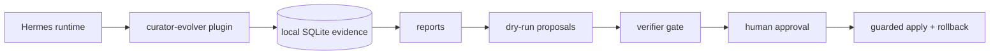

<div align="center">

# 🧬 Hermes Curator Evolver

<h3>Evidence-driven skill evolution for Hermes Agent — evidence first, proposals second, guarded apply last.</h3>

[](https://github.com/NousResearch/hermes-agent)
[](https://github.com/pingchesu/hermes-curator-evolver)
[](https://github.com/pingchesu/hermes-curator-evolver)
[](https://www.python.org/)
[](https://www.sqlite.org/)
[](#safety-model)
[](./LICENSE)

| 🔎 Evidence first | 🧠 Model-aware roadmap | 🛡️ Guarded apply | 🔌 Hermes plugin |
|:-:|:-:|:-:|:-:|
| Learn from real sessions | Use chat/embedding/rerankers only where useful | Approval + backup + verify + rollback | Tools, hooks, slash command, CLI |

</div>

---

## Why this exists

Hermes skills are powerful, but a growing skill library can become noisy: stale instructions, duplicated workflows, missing caveats, and hard-to-find lessons from past sessions.

**Hermes Curator Evolver** is a conservative companion to the official `hermes curator`. It turns local evidence into reviewable proposals, then only applies reviewed content through guardrails.

> The default loop is still safe: report → proposal → verifier → human approval → guarded apply.

## What it does

<table>
<tr>
<td>📡 <b>Observe</b></td>
<td>Hooks into Hermes runtime signals such as tool calls, skill usage, and session lifecycle events.</td>
</tr>
<tr>
<td>🗄️ <b>Store</b></td>
<td>Keeps compact local evidence in SQLite at <code>~/.hermes/plugins/curator-evolver/data/evidence.sqlite</code>.</td>
</tr>
<tr>
<td>📊 <b>Report</b></td>
<td>Generates markdown or JSON reports for skill governance review.</td>
</tr>
<tr>
<td>📝 <b>Propose</b></td>
<td>Builds dry-run, evidence-grounded proposal artifacts. No files are changed by proposal generation.</td>
</tr>
<tr>
<td>🔍 <b>Find candidates</b></td>
<td>Provides dependency-free lexical candidate search, semantic embedding execution on request, and optional reranking.</td>
</tr>
<tr>
<td>🛡️ <b>Apply safely</b></td>
<td>Applies reviewed content only with explicit approval, exact hash match, backup, optional verification, and rollback manifest.</td>
</tr>
</table>

## Quick start

Install and enable the Hermes directory plugin:

```bash
hermes plugins install pingchesu/hermes-curator-evolver --enable
hermes gateway restart
```

This activates the plugin hooks/tools. Current Hermes plugin installs clone the repo into `~/.hermes/plugins/curator-evolver`; they do **not** install Python console scripts automatically yet.

For the standalone CLI, install an editable entrypoint into the Hermes venv:

```bash
uv pip install --python ~/.hermes/hermes-agent/venv/bin/python -e ~/.hermes/plugins/curator-evolver
```

Then use the CLI:

```bash
hermes-curator-evolver status
hermes-curator-evolver report --days 7
hermes-curator-evolver analyze --skill hermes-agent --days 30
hermes-curator-evolver propose --skill hermes-agent --format json --output proposal.json
hermes-curator-evolver propose --skill hermes-agent --skill-file ~/.hermes/skills/autonomous-ai-agents/hermes-agent/SKILL.md --draft-with-model
hermes-curator-evolver verify --proposal-file proposal.json --skill hermes-agent
hermes-curator-evolver candidates --query "gateway plugin restart" --skills-dir ~/.hermes/skills
hermes-curator-evolver candidates --query "gateway plugin restart" --skills-dir ~/.hermes/skills --execute-semantic --rerank --format json
```

If you only want a one-off CLI smoke test without installing the entrypoint, run:

```bash
PYTHONPATH=~/.hermes/plugins/curator-evolver \
  ~/.hermes/hermes-agent/venv/bin/python -m hermes_curator_evolver status
```

Current Hermes versions can list and enable general plugins, but top-level `hermes <plugin>` CLI wiring may not expose general plugin commands yet. This plugin still registers `curator-evolver` through Hermes plugin APIs for forward compatibility; the stable command is `hermes-curator-evolver ...` after the editable CLI step above.

## Architecture

See [docs/architecture.md](docs/architecture.md) for the one-page architecture diagram, model usage plan, and safety boundary.



## Model usage plan

| Phase | Model | Purpose | Default |
| --- | --- | --- | --- |
| v0.1 | None | Evidence collection and report aggregation. | Local/read-only. |
| v0.2 | Hermes configured chat model | Draft improvement proposals from evidence + skill text. | Optional `--draft-with-model`; dry-run artifact; no skill writes. |
| v0.2 | Deterministic verifier + future verifier prompt | Check grounding, safety, and non-destructive behavior. | Blocks mutation by default. |
| v0.3/v0.5 | `Qwen/Qwen3-Embedding-0.6B` | Candidate skill/evidence/user-correction search. | Optional `--execute-semantic`; no default download. |
| v0.3/v0.5 | `BAAI/bge-reranker-v2-m3` | Re-rank candidates, especially for mixed Chinese/English agent workflows. | Optional `--rerank`; no default download. |
| v0.4 | Verifier + local validation command | Guard final reviewed content before apply. | Requires approval, backup, verification, rollback. |

## Safety model

The guarded path requires:

1. evidence report,
2. dry-run proposal,
3. verifier pass,
4. human-reviewed content,
5. exact target SHA256 match,
6. explicit `--approve`,
7. backup manifest,
8. optional validation command,
9. rollback path.

Hard defaults:

- ✅ Evidence/report/proposal/candidate commands do not mutate skills.
- ✅ Semantic mode does not download models by default; `--execute-semantic` / `--rerank` are explicit opt-ins.
- ✅ Apply refuses to run without `--approve`.
- ✅ Apply refuses if the target SHA256 changed.
- ✅ Apply creates a backup before writing.
- ✅ Failed validation auto-restores the backup.

## CLI reference

```bash
# Evidence
hermes-curator-evolver status
hermes-curator-evolver report --days 7 --format json
hermes-curator-evolver analyze --skill hermes-agent --days 30

# Proposal + verifier
hermes-curator-evolver propose --skill hermes-agent --skill-file ./SKILL.md --format json --output proposal.json
hermes-curator-evolver propose --skill hermes-agent --skill-file ./SKILL.md --draft-with-model --model-timeout 180
hermes-curator-evolver verify --proposal-file proposal.json --skill hermes-agent --format json

# Candidate generation
hermes-curator-evolver candidates --query "gateway restart plugin cli" --skills-dir ~/.hermes/skills
hermes-curator-evolver candidates --query "中文 mixed agent skill" --skills-dir ~/.hermes/skills --semantic --format json       # plan only
hermes-curator-evolver candidates --query "中文 mixed agent skill" --skills-dir ~/.hermes/skills --execute-semantic --format json
hermes-curator-evolver candidates --query "中文 mixed agent skill" --skills-dir ~/.hermes/skills --execute-semantic --rerank --format json

# Guarded apply
sha256sum ./SKILL.md
hermes-curator-evolver apply \
  --target ./SKILL.md \
  --content-file ./reviewed-SKILL.md \
  --expected-sha256 <current-sha256> \
  --backup-dir .curator-evolver-backups \
  --verify-command "python -m pytest -q" \
  --approve

# Rollback
hermes-curator-evolver rollback --manifest .curator-evolver-backups/<timestamp>/manifest.json
```

## Agent tool

When enabled, Hermes can call:

```text
curator_evidence_report
```

to retrieve a JSON evidence report.

## Install from source

```bash
git clone https://github.com/pingchesu/hermes-curator-evolver.git
cd hermes-curator-evolver
python -m pip install -e .
hermes plugins enable curator-evolver
```

If your Hermes environment does not provide `pip`, use:

```bash
uv pip install -e .
```

## Directory-plugin install

You can also symlink this repository into the Hermes plugin directory:

```bash
mkdir -p ~/.hermes/plugins
ln -s /path/to/hermes-curator-evolver ~/.hermes/plugins/curator-evolver
hermes plugins enable curator-evolver
```

## Data location

Default:

```text
~/.hermes/plugins/curator-evolver/data/evidence.sqlite
```

Override:

```bash
export HERMES_CURATOR_EVOLVER_DB=/custom/path.sqlite
```

## Roadmap status

- ✅ **v0.1** — evidence/report plugin.
- ✅ **v0.2** — proposal generation + verifier gate, dry-run by default.
- ✅ **v0.3** — candidate generation interface with optional embedding/reranker model plan.
- ✅ **v0.4** — guarded apply with explicit approval, backup, verification, and rollback.
- ✅ **v0.5** — explicit model execution paths: Hermes chat-model drafts, Qwen embedding candidate ranking, and bge reranking.

---

<div align="center">

Built for people who want agent skills to improve — without letting automation silently rewrite the library.

</div>
