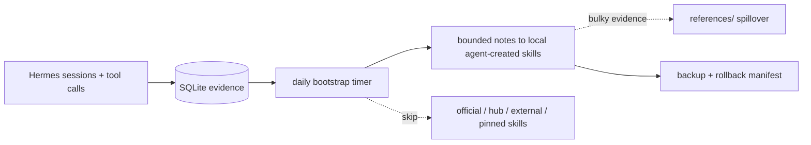
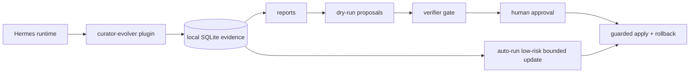

<div align="center">

# 🧬 Hermes Curator Evolver

<h3>Make Hermes skills improve from real usage — with evidence, review, and rollback.</h3>

<p>
  <b>Inspired by <a href="https://github.com/AMAP-ML/SkillClaw">SkillClaw</a></b>, adapted for Hermes Agent as a local-first plugin:<br/>
  session evidence in, safer skill updates out.
</p>

<p>
  If you use Hermes skills heavily and do not want them to silently rot, this plugin turns real usage into reviewable, reversible skill maintenance.
</p>

[](https://github.com/NousResearch/hermes-agent)
[](https://github.com/AMAP-ML/SkillClaw)
[](https://github.com/pingchesu/hermes-curator-evolver)
[](https://github.com/pingchesu/hermes-curator-evolver)
[](https://www.python.org/)
[](https://www.sqlite.org/)
[](#safety-model)
[](./LICENSE)

| 📚 Session evidence | 📥 Backfill today | 🧠 Optional semantic search | 🛡️ Guarded automation |
|:-:|:-:|:-:|:-:|
| Learn from real Hermes work | Import old `session_*.json` history | Embedding + rerank only when selected | Bounded notes, reference spillover, rollback |

</div>

---

## Contents

- [Who this is for](#who-this-is-for)
- [Quick start: install, backfill, autorun](#quick-start-install-backfill-autorun)
- [At a glance](#at-a-glance)
- [Trust boundary](#trust-boundary)
- [Why this exists](#why-this-exists)
- [Inspired by SkillClaw, made Hermes-native](#inspired-by-skillclaw-made-hermes-native)
- [Launch / discussion kit](#launch--discussion-kit)
- [Architecture](#architecture)
- [Model usage plan](#model-usage-plan)
- [Safety model](#safety-model)
- [Examples and demo](#examples-and-demo)
- [Feedback wanted](#feedback-wanted)
- [CLI reference](#cli-reference)
- [Contributing](#contributing)
- [Uninstall](#uninstall)

## Who this is for

Hermes Curator Evolver is for people who treat agent skills as operational memory: debugging playbooks, deployment habits, project conventions, and lessons learned from real work. It helps answer a practical question: **how can those skills improve from evidence without letting automation silently rewrite the library?**

Use it when you want:

- local evidence reports before any skill update,
- dry-run proposals that can be reviewed like maintenance notes,
- explicit write approval, exact target-hash checks, backups, and rollback,
- safe unattended maintenance limited to bounded managed blocks,
- optional semantic search/rerank only when you choose to enable it.

It is **not** a general AutoML system, a skill marketplace, or an agent that freely rewrites every prompt it can see. The default path is local, model-free, reversible, and intentionally boring.

## Quick start: install, backfill, autorun

Copy, paste, done. `bootstrap` handles the noisy parts: backfill old sessions + enable daily safe autorun.

```bash
hermes plugins install pingchesu/hermes-curator-evolver --enable
uv pip install --python ~/.hermes/hermes-agent/venv/bin/python -e ~/.hermes/plugins/curator-evolver
hermes-curator-evolver bootstrap
```

That is the default, model-free path. It writes only low-risk bounded notes to **local agent-created** skills, spills bulky evidence into `references/` when needed, then validates the changed `SKILL.md` before the apply is considered successful. Official/bundled, hub-installed, plugin-provided, `skills.external_dirs`, pinned, unknown-source, and already-over-hard-cap skills are skipped.

Want multilingual semantic/rerank ordering? Make the opt-in explicit:

```bash
uv pip install --python ~/.hermes/hermes-agent/venv/bin/python -e "$HOME/.hermes/plugins/curator-evolver[semantic]"
hermes-curator-evolver bootstrap --semantic
```

Quick checks:

```bash
hermes-curator-evolver status
systemctl --user list-timers 'hermes-curator-evolver*' --all --no-pager
```

If Hermes gateway was already running, restart it once so plugin hooks are loaded. For health checks, timer logs, model details, and uninstall steps, see [docs/after-install.md](docs/after-install.md).

## At a glance

| 1. Collect | 2. Rank | 3. Improve | 4. Protect |
|:-:|:-:|:-:|:-:|
| Tool calls + skill loads + old sessions | Evidence counts; optional Qwen + bge rerank | Daily bounded notes + reference spillover + post-apply validation | Only local agent-created skills are writable |



| User concern | Short answer |
| --- | --- |
| **Will it run by itself?** | Yes. `bootstrap` enables a daily user-level timer. |
| **Will it rewrite my skills?** | No. Autorun only updates a managed bounded block and spills bulky evidence to `references/`. |
| **Will it touch official/team skills?** | No. Provenance gate skips bundled, hub, plugin, and `external_dirs` skills. |
| **Can I inspect first?** | Yes. `auto-run --format json` is dry-run by default. |

## Trust boundary

The default experience is designed to be inspectable before it is writable:

- **Read-only first:** `status`, `report`, `analyze`, `candidates`, `propose`, `verify`, and default `auto-run` do not mutate skills.
- **No blind model dependency:** the default bootstrap path is model-free; model-assisted proposal drafting and semantic/rerank ordering require explicit opt-in flags.
- **Narrow unattended writes:** low-risk autorun writes only a managed bounded notes block, and only after both `--apply-low-risk` and `--approve-auto-apply`.
- **Size guardrails:** `SKILL.md` updates target a 90k soft cap, spill bulky evidence into `references/`, and skip unattended writes when the target skill is already over the 100k hard cap.
- **Source provenance gate:** official/bundled, hub-installed, plugin-provided, `skills.external_dirs`, pinned, and unknown-source skills are skipped from unattended writes.
- **Rollback is concrete:** guarded apply records backups and manifests so you can restore exact prior content.

For a quick visual walkthrough, see [docs/demo-script.md](docs/demo-script.md). For synthetic output examples, see [examples/](examples/).

## Why this exists

Hermes skills are operational memory. They capture how an agent should debug, deploy, research, and communicate in a real environment. But memory decays: stale commands, duplicated workflows, missing caveats, weak trigger descriptions, and hard-won lessons trapped in old session logs.

**Hermes Curator Evolver** closes that loop: session evidence in, safer skill updates out — without patching Hermes core or silently rewriting your skill library.

## Inspired by SkillClaw, made Hermes-native

[SkillClaw](https://github.com/AMAP-ML/SkillClaw) showed the right idea: agents should evolve skills from session trajectories. Hermes Curator Evolver adapts that idea to a local-first Hermes plugin.

| SkillClaw lesson | Hermes-native adaptation |
| --- | --- |
| Learn from sessions. | Runtime hooks + historical backfill feed local SQLite evidence. |
| Retrieve similar skills before editing. | Lexical search by default; optional Qwen embeddings + bge reranking. |
| Verify skill changes. | Dry-run proposals, verifier gates, exact SHA match, backups, rollback. |
| Avoid uncontrolled mutation. | No Hermes core patches, pinned skills are skipped, official/hub/external/plugin skills are protected from unattended writes, autorun is bounded and can spill bulky evidence into `references/`. |

## Launch / discussion kit

If you are evaluating or sharing the project, start with the smallest concrete claim:

> A local-first Hermes Agent plugin that turns session history into evidence-backed skill maintenance, with dry-run proposals and provenance-safe bounded autorun.

Useful links for reviewers and community posts:

- [docs/core-algorithm.md](docs/core-algorithm.md) — exact evidence, candidate-selection, semantic/rerank, and autorun algorithm.
- [docs/architecture.md](docs/architecture.md) — one-page architecture and safety boundary.
- [docs/after-install.md](docs/after-install.md) — what to expect after install, health checks, timers, and uninstall.
- [docs/hyperagents-design-notes.md](docs/hyperagents-design-notes.md) — clean-room design notes explaining why HyperAgents is *not* a dependency and which concepts (multi-variant candidates, staged verifier) are adapted.
- [docs/reddit-launch.md](docs/reddit-launch.md) — recommended cadence and concise community-post drafts.
- [docs/reddit-launch-kit.md](docs/reddit-launch-kit.md) — expanded subreddit-specific titles, replies, and disclosure notes.

## Architecture

See [docs/architecture.md](docs/architecture.md) for the one-page architecture diagram, model usage plan, and safety boundary. See [docs/after-install.md](docs/after-install.md) for the post-install autorun guide, health checks, uninstall path, and supported models.



## Model usage plan

| Phase | Model | Purpose | Default |
| --- | --- | --- | --- |
| v0.1 | None | Evidence collection and report aggregation. | Local/read-only. |
| v0.2 | Hermes configured chat model | Draft improvement proposals from evidence + skill text. | Optional `--draft-with-model`; dry-run artifact; no skill writes. |
| v0.2 | Deterministic verifier + future verifier prompt | Check grounding, safety, and non-destructive behavior. | Blocks mutation by default. |
| v0.3/v0.5 | `Qwen/Qwen3-Embedding-0.6B` | Candidate skill/evidence/user-correction search. | Optional `--execute-semantic`; no default download. |
| v0.3/v0.5 | `BAAI/bge-reranker-v2-m3` | Re-rank candidates, especially for mixed Chinese/English agent workflows. | Optional `--rerank`; no default download. |
| v0.4 | Verifier + local validation command | Guard final reviewed content before apply. | Requires approval, backup, verification, rollback. |
| v0.6 | None by default | Automatic low-risk managed skill updates from observed evidence. | Optional `install-auto`; no Hermes core modification. |
| v0.7 | `Qwen/Qwen3-Embedding-0.6B` + `BAAI/bge-reranker-v2-m3` | Optional model-assisted autorun candidate ordering. | Explicit `--semantic-candidates --rerank-candidates`; models only reorder evidence-eligible candidates. |
| v0.9 | None | Provenance-safe unattended auto-apply. | Writes only local agent-created skills; skips bundled, hub, plugin, external, pinned, and unknown sources. |
| v0.10 | None by default | One-command setup and clearer public README. | `bootstrap` backfills sessions and installs/enables autorun; `bootstrap --semantic` is explicit model opt-in. |
| v0.11 | None | Size-bounded unattended auto-apply. | Keeps `SKILL.md` under the 100k tool cap by targeting a 90k soft cap, spilling bulky evidence into `references/`, and skipping already-over-hard-cap skills. |

## Safety model

The guarded path requires:

1. evidence report,
2. dry-run proposal,
3. verifier pass,
4. human-reviewed content,
5. exact target SHA256 match,
6. explicit `--approve`,
7. backup manifest,
8. optional validation command,
9. rollback path.

Hard defaults:

- ✅ Evidence/report/proposal/candidate commands do not mutate skills.
- ✅ Semantic mode does not download models by default; `--execute-semantic` / `--rerank` are explicit opt-ins.
- ✅ Apply refuses to run without `--approve`.
- ✅ Apply refuses if the target SHA256 changed.
- ✅ Apply creates a backup before writing.
- ✅ Failed validation auto-restores the backup.
- ✅ `auto-run` writes only managed bounded blocks and still requires both `--apply-low-risk` and `--approve-auto-apply` before mutation.
- ✅ Bulky autorun evidence spills into `references/` instead of growing `SKILL.md` past the tool cap; already-over-hard-cap skills are skipped.
- ✅ Even with both write flags, unattended auto-apply writes only local agent-created skills. Official/bundled skills (`.bundled_manifest`), hub-installed skills (`.hub/lock.json`), plugin-provided skills, `skills.external_dirs`, pinned skills, and unknown sources are skipped.
- ✅ `--semantic-candidates` / `--rerank-candidates` are explicit opt-ins and only reorder skills that already passed the evidence threshold.
- ✅ Optional `--variants N` (default `1`) deterministically generates up to four bounded variants and picks one winner; only the winner is applied, and variant generation never executes model-generated code. See [docs/hyperagents-design-notes.md](docs/hyperagents-design-notes.md).
- ✅ Optional staged verifier gate: cheap built-in structural check (managed-block + size invariants) runs before any expensive `--verify-command`, so a failing cheap stage skips the expensive stage entirely and still rolls back.

## Examples and demo

If you want to inspect the behavior before installing, start here:

- [60-second demo script](docs/demo-script.md) — terminal walkthrough for a GIF/asciinema recording.
- [Example artifacts](examples/) — synthetic report, proposal, bounded managed-block diff, and rollback manifest.
- [Promotion readiness plan](docs/promotion-readiness-plan.md) — what changed to make the repo easier to evaluate publicly.
- [Architecture notes](docs/architecture.md) — one-page data flow and safety boundary.
- [Post-install guide](docs/after-install.md) — health checks, timer logs, model details, and uninstall steps.

## Feedback wanted

This project is intentionally conservative, and feedback is most useful around the trust model:

1. Is the provenance gate strict enough for unattended skill maintenance?
2. Should proposals become PR-like diffs instead of bounded managed notes?
3. Which evidence signals should count: tool sequences, repeated fixes, user corrections, failed commands, or something else?
4. What rollback UX would make automated skill maintenance trustworthy?
5. What evaluation would show that a skill update actually improves future agent behavior?

If you are sharing or reviewing this project publicly, the community launch notes and draft posts live in [docs/reddit-launch.md](docs/reddit-launch.md).

## CLI reference

```bash
# One-command bootstrap
hermes-curator-evolver bootstrap
hermes-curator-evolver bootstrap --semantic
hermes-curator-evolver bootstrap --format json

# Evidence
hermes-curator-evolver status
hermes-curator-evolver report --days 7 --format json
hermes-curator-evolver backfill-sessions --sessions-dir ~/.hermes/sessions --days 30 --format json
hermes-curator-evolver analyze --skill hermes-agent --days 30

# Proposal + verifier
hermes-curator-evolver propose --skill hermes-agent --skill-file ./SKILL.md --format json --output proposal.json
hermes-curator-evolver propose --skill hermes-agent --skill-file ./SKILL.md --draft-with-model --model-timeout 180
hermes-curator-evolver verify --proposal-file proposal.json --skill hermes-agent --format json

# Candidate generation
hermes-curator-evolver candidates --query "gateway restart plugin cli" --skills-dir ~/.hermes/skills
hermes-curator-evolver candidates --query "中文 mixed agent skill" --skills-dir ~/.hermes/skills --semantic --format json       # plan only
hermes-curator-evolver candidates --query "中文 mixed agent skill" --skills-dir ~/.hermes/skills --execute-semantic --format json
hermes-curator-evolver candidates --query "中文 mixed agent skill" --skills-dir ~/.hermes/skills --execute-semantic --rerank --format json

# Guarded apply
sha256sum ./SKILL.md
hermes-curator-evolver apply \
  --target ./SKILL.md \
  --content-file ./reviewed-SKILL.md \
  --expected-sha256 <current-sha256> \
  --backup-dir .curator-evolver-backups \
  --verify-command "python -m pytest -q" \
  --approve

# Rollback
hermes-curator-evolver rollback --manifest .curator-evolver-backups/<timestamp>/manifest.json

# Automatic evolution
hermes-curator-evolver auto-run --skills-dir ~/.hermes/skills --format json                  # dry-run
hermes-curator-evolver auto-run --skills-dir ~/.hermes/skills --semantic-candidates --rerank-candidates --format json
hermes-curator-evolver auto-run --skills-dir ~/.hermes/skills --apply-low-risk --approve-auto-apply
hermes-curator-evolver auto-run --skills-dir ~/.hermes/skills --semantic-candidates --rerank-candidates --apply-low-risk --approve-auto-apply
hermes-curator-evolver auto-run --skills-dir ~/.hermes/skills --apply-low-risk --approve-auto-apply --block-auto-apply-skill 'github-*'
hermes-curator-evolver auto-run --skills-dir ~/.hermes/skills --apply-low-risk --approve-auto-apply --allow-auto-apply-skill store-playbook  # only within local agent-created source boundary
hermes-curator-evolver auto-run --skills-dir ~/.hermes/skills --variants 3 --format json                                                   # generate 3 deterministic variants, pick winner (dry-run)
hermes-curator-evolver auto-run --skills-dir ~/.hermes/skills --apply-low-risk --approve-auto-apply --staged-verify                        # cheap built-in check before expensive verify
hermes-curator-evolver install-auto --schedule daily --enable
hermes-curator-evolver install-auto --schedule daily --enable --semantic-candidates --rerank-candidates
hermes-curator-evolver uninstall-auto
```

## Contributing

Contributions are welcome. See [CONTRIBUTING.md](CONTRIBUTING.md) for local setup, TDD expectations, PR checklist, smoke tests, and CI behavior.

## Credits and inspiration

**Inspired by [SkillClaw](https://github.com/AMAP-ML/SkillClaw)** — especially the idea that agent skills should evolve from real session evidence, not only from hand-written maintenance. Hermes Curator Evolver keeps that inspiration, but applies it through Hermes-native plugin hooks, local SQLite evidence, explicit model opt-ins, and conservative guarded writes.

## Uninstall

Hermes already provides plugin removal:

```bash
hermes plugins disable curator-evolver
hermes plugins uninstall curator-evolver   # alias: remove/rm
```

If you enabled the optional auto-evolve timer, remove it first:

```bash
hermes-curator-evolver uninstall-auto
```

Plugin removal does not delete historical evidence by default. Remove it manually only if you want a clean slate:

```bash
rm -rf ~/.hermes/plugins/curator-evolver/data ~/.hermes/plugins/curator-evolver/backups
```

## Agent tool

When enabled, Hermes can call:

```text
curator_evidence_report
```

to retrieve a JSON evidence report.

## Install from source

```bash
git clone https://github.com/pingchesu/hermes-curator-evolver.git
cd hermes-curator-evolver
python -m pip install -e .
hermes plugins enable curator-evolver
```

If your Hermes environment does not provide `pip`, use:

```bash
uv pip install -e .
```

## Directory-plugin install

You can also symlink this repository into the Hermes plugin directory:

```bash
mkdir -p ~/.hermes/plugins
ln -s /path/to/hermes-curator-evolver ~/.hermes/plugins/curator-evolver
hermes plugins enable curator-evolver
```

## Data location

Default:

```text
~/.hermes/plugins/curator-evolver/data/evidence.sqlite
```

Override:

```bash
export HERMES_CURATOR_EVOLVER_DB=/custom/path.sqlite
```

## Roadmap status

- ✅ **v0.1** — evidence/report plugin.
- ✅ **v0.2** — proposal generation + verifier gate, dry-run by default.
- ✅ **v0.3** — candidate generation interface with optional embedding/reranker model plan.
- ✅ **v0.4** — guarded apply with explicit approval, backup, verification, and rollback.
- ✅ **v0.5** — explicit model execution paths: Hermes chat-model drafts, Qwen embedding candidate ranking, and bge reranking.
- ✅ **v0.6** — plug-and-play `auto-run` + optional systemd timer for low-risk managed skill improvements without Hermes core changes.
- ✅ **v0.7** — explicit `--semantic-candidates` / `--rerank-candidates` for model-assisted autorun candidate ordering.
- ✅ **v0.8** — `backfill-sessions` for existing Hermes history, `CONTRIBUTING.md`, and GitHub Actions CI.
- ✅ **v0.9** — provenance-safe autorun: only local agent-created skills can be auto-applied; bundled, hub, plugin, external, pinned, and unknown sources are skipped.
- ✅ **v0.10** — `bootstrap` one-command setup plus a shorter, visual quick start.
- ✅ **v0.11** — size-bounded autorun: target a 90k `SKILL.md` soft cap, spill bulky evidence into `references/`, and skip already-over-hard-cap skills.

---

<div align="center">

Built for people who want agent skills to improve — without letting automation silently rewrite the library.

</div>
