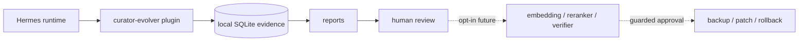

<div align="center">

# 🧬 Hermes Curator Evolver

<h3>Evidence-driven skill evolution for Hermes Agent — start read-only, grow safely.</h3>

[](https://github.com/NousResearch/hermes-agent)
[](https://github.com/pingchesu/hermes-curator-evolver)
[](https://github.com/pingchesu/hermes-curator-evolver)
[](https://www.python.org/)
[](https://www.sqlite.org/)
[](#safety-model)
[](./LICENSE)

| 🔎 Evidence first | 🧠 Model-aware roadmap | 🛡️ Guarded evolution | 🔌 Hermes plugin |
|:-:|:-:|:-:|:-:|
| Learn from real sessions | Use embeddings/rerankers only when useful | No mutation in v0.1 | Tools, hooks, slash command, CLI |

</div>

---

## Why this exists

Hermes skills are powerful, but a growing skill library can slowly become noisy: stale instructions, duplicated workflows, missing caveats, and hard-to-find lessons from past sessions.

**Hermes Curator Evolver** is a conservative companion to the official `hermes curator`. Instead of immediately rewriting skills, it starts by collecting local evidence and explaining what deserves attention.

> v0.1 does not evolve your skill files automatically. It gives you the evidence report first.

## What it does today

<table>
<tr>
<td>📡 <b>Observe</b></td>
<td>Hooks into Hermes runtime signals such as tool calls, skill usage, and session lifecycle events.</td>
</tr>
<tr>
<td>🗄️ <b>Store</b></td>
<td>Keeps compact local evidence in SQLite at <code>~/.hermes/plugins/curator-evolver/data/evidence.sqlite</code>.</td>
</tr>
<tr>
<td>📊 <b>Report</b></td>
<td>Generates markdown or JSON reports for skill governance review.</td>
</tr>
<tr>
<td>🛡️ <b>Stay safe</b></td>
<td>Does not call <code>skill_manage</code>, does not edit skills, and does not download embedding models by default.</td>
</tr>
</table>

## Quick start

```bash
hermes plugins install pingchesu/hermes-curator-evolver --enable
```

Restart Hermes after enabling plugins.

Then use the standalone CLI:

```bash
hermes-curator-evolver status
hermes-curator-evolver report --days 7
hermes-curator-evolver report --days 7 --format json
hermes-curator-evolver analyze --skill hermes-agent --days 30
```

Current Hermes versions can list and enable general plugins, but top-level `hermes <plugin>` CLI wiring may not expose general plugin commands yet. This plugin still registers `curator-evolver` through Hermes plugin APIs for forward compatibility; the stable v0.1 command is `hermes-curator-evolver ...`.

## Architecture

See [docs/architecture.md](docs/architecture.md) for the one-page architecture diagram, model usage plan, and safety boundary.



## Model usage plan

v0.1 uses **no AI model**. The first version is deterministic and read-only.

| Phase | Model | Purpose | Default |
| --- | --- | --- | --- |
| v0.1 | None | Evidence collection and report aggregation. | Local/read-only. |
| v0.2 | Hermes configured chat model | Draft improvement proposals from evidence + skill text. | Dry-run only. |
| v0.2 | Hermes configured chat model + verifier prompt | Check grounding, safety, and non-destructive behavior. | Blocks mutation. |
| v0.3 | `Qwen3-Embedding-0.6B` | Find candidate skills/evidence/user corrections that may relate to each other. | Optional semantic mode. |
| v0.3 | `bge-reranker-v2-m3` | Re-rank candidates, especially for mixed Chinese/English agent workflows. | Optional semantic mode. |
| v0.4 | Hermes configured chat model + verifier | Produce final patch text after review. | Requires approval, backup, verification, rollback. |

## Safety model

v0.1 is intentionally conservative:

- ✅ Read-only evidence and reports.
- ✅ Local SQLite storage.
- ✅ No automatic skill mutation.
- ✅ No writes into `~/.hermes/skills`.
- ✅ No calls to `skill_manage`.
- ✅ No embedding/reranker downloads by default.

Future guarded apply must require:

1. human approval,
2. backup,
3. verifier pass,
4. test/validation pass,
5. rollback path.

## Agent tool

When enabled, Hermes can call:

```text
curator_evidence_report
```

to retrieve a JSON evidence report.

## Install from source

```bash
git clone https://github.com/pingchesu/hermes-curator-evolver.git
cd hermes-curator-evolver
python -m pip install -e .
hermes plugins enable curator-evolver
```

If your Hermes environment does not provide `pip`, use:

```bash
uv pip install -e .
```

## Directory-plugin install

You can also symlink this repository into the Hermes plugin directory:

```bash
mkdir -p ~/.hermes/plugins
ln -s /path/to/hermes-curator-evolver ~/.hermes/plugins/curator-evolver
hermes plugins enable curator-evolver
```

## Data location

Default:

```text
~/.hermes/plugins/curator-evolver/data/evidence.sqlite
```

Override:

```bash
export HERMES_CURATOR_EVOLVER_DB=/custom/path.sqlite
```

## Roadmap

- **v0.1** — read-only evidence/report plugin.
- **v0.2** — proposal generation + verifier gate, dry-run only.
- **v0.3** — optional semantic candidate generation with embeddings/rerankers.
- **v0.4** — guarded apply with explicit approval, backup, verification, and rollback.

---

<div align="center">

Built for people who want agent skills to improve — without letting automation silently rewrite the library.

</div>
