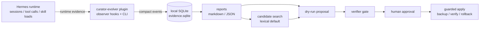

# Hermes Curator Evolver Architecture

`hermes-curator-evolver` is a small evidence layer around Hermes skills. It does **not** replace the official `hermes curator`; it observes what happened, summarizes why a skill may need improvement, drafts reviewable proposals, and applies reviewed content only through guardrails.

## One-page architecture



The safety rule is simple: everything before `Apply` is non-mutating; `Apply` requires explicit approval and creates a rollback manifest.

## What each part does

| Part | Role |
| --- | --- |
| Hermes runtime | Produces session/tool/skill activity signals. |
| `curator-evolver` plugin | Registers observer hooks, a report tool, a slash command, and CLI entry points. |
| SQLite evidence store | Keeps compact local evidence under `~/.hermes/plugins/curator-evolver/data/evidence.sqlite`. |
| Reports | Shows which skills/tools produced useful or problematic evidence. |
| Candidate search | Finds likely related skills with lexical search by default; semantic models are opt-in only. |
| Proposal | Produces dry-run review artifacts grounded in evidence. |
| Verifier | Blocks ungrounded, mutating, or destructive proposals. |
| Guarded apply | Writes reviewed content only after approval/hash/backup/verify gates. |

## Model usage plan

| Phase | Model | Used for | Default behavior |
| --- | --- | --- | --- |
| v0.1 | None | Evidence collection and report aggregation. | Local/read-only. |
| v0.2 | Hermes configured chat model plan | Drafting improvement proposals from evidence and existing skill text. | Dry-run artifact; no skill writes. |
| v0.2 | Deterministic verifier + future verifier prompt | Checking whether a proposal is grounded, safe, and non-destructive. | Blocks mutation by default. |
| v0.3 | `Qwen3-Embedding-0.6B` | Embedding skills, session evidence, and user corrections to find candidate skills. | Optional semantic mode; no default model download. |
| v0.3 | `bge-reranker-v2-m3` | Re-ranking candidate skills/evidence after embedding search, especially for Chinese/English mixed workflows. | Optional semantic mode; no default model download. |
| v0.4 | Verifier + local validation command | Guarding reviewed content before it is applied. | Requires approval, backup, verification, and rollback path. |

Notes:

- Chat/proposal/verifier text generation should follow the user's active Hermes provider configuration instead of being hardcoded in this plugin.
- Embedding/reranker models are candidate-generation aids only; they do not decide or apply edits by themselves.
- Semantic mode currently exposes the model plan and interface without downloading or running models by default.

## Safety boundary

```mermaid
flowchart LR
    Evidence[collect evidence] --> Report[generate report]
    Report --> Proposal[dry-run proposal]
    Proposal --> Verify[verifier gate]
    Verify --> Approval[human approval]
    Approval --> Backup[backup + manifest]
    Backup --> Patch[write reviewed content]
    Patch --> Validate[optional validation command]
    Validate -. fail .-> AutoRollback[auto rollback]
    Validate -. pass .-> Done[done]
    Done --> ManualRollback[manual rollback available]

    classDef readonly fill:#dbeafe,stroke:#2563eb,color:#0f172a;
    classDef guarded fill:#fef3c7,stroke:#d97706,color:#0f172a;
    class Evidence,Report,Proposal,Verify readonly;
    class Approval,Backup,Patch,Validate,AutoRollback,Done,ManualRollback guarded;
```



Hard rules:

- Evidence/report/proposal/candidate commands do not mutate skills.
- Candidate search is advisory.
- Semantic model execution is opt-in and performs no default downloads.
- Guarded apply requires exact target SHA256 and `--approve`.
- Guarded apply creates a backup and manifest before writing.
- Failed validation restores the backup automatically.

## Current commands

```bash
hermes-curator-evolver status
hermes-curator-evolver report --days 7 --format json
hermes-curator-evolver propose --skill hermes-agent --format json --output proposal.json
hermes-curator-evolver verify --proposal-file proposal.json --skill hermes-agent
hermes-curator-evolver candidates --query "gateway restart" --skills-dir ~/.hermes/skills
hermes-curator-evolver apply --target ./SKILL.md --content-file ./reviewed-SKILL.md --expected-sha256 <sha> --approve
hermes-curator-evolver rollback --manifest .curator-evolver-backups/<timestamp>/manifest.json
```

The plugin also registers `curator-evolver` through Hermes plugin APIs for forward compatibility, but current Hermes builds may not expose it as `hermes curator-evolver ...` yet.
