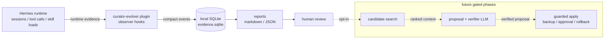

# Hermes Curator Evolver Architecture

`hermes-curator-evolver` is a small evidence layer around Hermes skills. It does **not** replace the official `hermes curator`; it observes what happened, summarizes why a skill may need improvement, and only later proposes reviewed changes.

## One-page architecture



In v0.1, the flow stops at **reports**. The future path is intentionally dashed because it must stay opt-in and guarded.

## What each part does

| Part | Current role |
| --- | --- |
| Hermes runtime | Produces session/tool/skill activity signals. |
| `curator-evolver` plugin | Registers observer hooks, a report tool, and CLI entry points. |
| SQLite evidence store | Keeps compact local evidence under `~/.hermes/plugins/curator-evolver/data/evidence.sqlite`. |
| Reports | Shows which skills/tools produced useful or problematic evidence. |
| Human review | Decides whether a skill should be edited, split, renamed, merged, or left alone. |

## Model usage plan

v0.1 uses **no AI model**. It only records evidence and builds deterministic reports.

| Phase | Model | Used for | Default behavior |
| --- | --- | --- | --- |
| v0.1 | None | Evidence collection and report aggregation. | Always local/read-only. |
| v0.2 | Hermes configured chat model | Drafting improvement proposals from evidence and existing skill text. | Dry-run only; writes proposal output, not skill files. |
| v0.2 | Hermes configured chat model, separate verifier prompt | Checking whether a proposal is grounded in evidence, preserves safety boundaries, and avoids destructive edits. | Blocks apply; still no mutation by default. |
| v0.3 | `Qwen3-Embedding-0.6B` | Embedding skills, session evidence, and user corrections to find candidate skills that may need updates. | Optional semantic mode; no default model download. |
| v0.3 | `bge-reranker-v2-m3` | Re-ranking candidate skills/evidence after embedding search, especially for multilingual Chinese/English cases. | Optional semantic mode; no default model download. |
| v0.4 | Hermes configured chat model + verifier | Producing final patch text after candidate retrieval and review. | Requires explicit approval, backup, verification, and rollback path. |

Notes:

- The chat/proposal/verifier model should follow the user's active Hermes provider configuration instead of being hardcoded in this plugin.
- Embedding/reranker models are planned for candidate generation only; they should not decide or apply edits by themselves.
- The first safe default is still lexical/evidence-based reporting. Semantic search is an opt-in accelerator, not a requirement.

## Safety boundary

```mermaid
flowchart LR
    Evidence[collect evidence] --> Report[generate report]
    Report --> Review[human review]
    Review -. future opt-in .-> Proposal[draft proposal]
    Proposal -. verifier pass + approval .-> Patch[guarded patch]
    Patch -. verify fail .-> Rollback[rollback]

    classDef current fill:#dbeafe,stroke:#2563eb,color:#0f172a;
    classDef future fill:#fef3c7,stroke:#d97706,color:#0f172a;
    class Evidence,Report,Review current;
    class Proposal,Patch,Rollback future;
```



Hard rules:

- v0.1 does not call `skill_manage`.
- v0.1 does not write into `~/.hermes/skills`.
- v0.1 does not delete, rename, or merge skills.
- Future mutation must require explicit approval, backup, verification, and rollback.

## Current commands

```bash
hermes-curator-evolver status
hermes-curator-evolver report --days 7
hermes-curator-evolver report --days 7 --format json
```

The plugin also registers `curator-evolver` through Hermes plugin APIs for forward compatibility, but current Hermes builds may not expose it as `hermes curator-evolver ...` yet.
