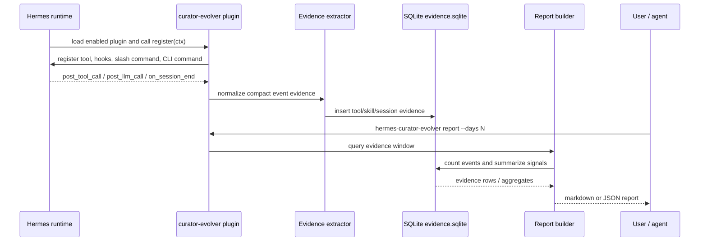
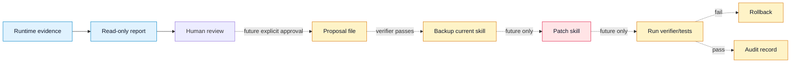
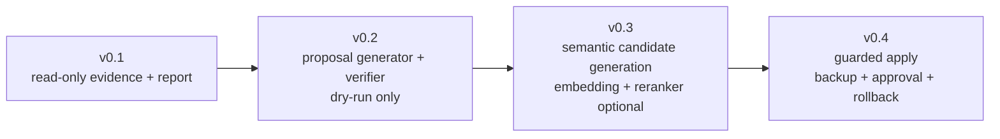

# Hermes Curator Evolver Architecture

This document explains how `hermes-curator-evolver` is intended to work and how it stays separate from the official `hermes curator` implementation.

## Design intent

`hermes-curator-evolver` is an **evidence layer**, not a replacement curator.

The plugin observes Hermes runtime signals, stores compact local evidence, and produces reports that help a human decide whether a skill should be improved. v0.1 does **not** mutate skills, call `skill_manage`, delete files, or rewrite the official curator state.

## System architecture

```mermaid
flowchart LR
    subgraph Runtime[Hermes Agent runtime]
        User[User session]
        Agent[Agent loop]
        Tools[Hermes tools]
        Skills[Skill loader]
        CoreCurator[Official hermes curator]
    end

    subgraph Plugin[hermes-curator-evolver plugin]
        Register[register(ctx)]
        Hooks[Observer hooks\npost_tool_call / post_llm_call / on_session_end]
        Extractor[Evidence extractor]
        Store[(SQLite evidence store)]
        Reporter[Report builder]
        AgentTool[curator_evidence_report tool]
        CLI[hermes-curator-evolver CLI]
    end

    subgraph Future[Future guarded phases]
        Proposal[Proposal generator\ndry-run only]
        Verifier[Verifier gate]
        Apply[Guarded apply\nbackup / review / rollback]
    end

    User --> Agent
    Agent --> Tools
    Agent --> Skills
    Agent -. official skill hygiene .-> CoreCurator

    Register --> Hooks
    Register --> AgentTool
    Register --> CLI

    Tools -. observed result metadata .-> Hooks
    Skills -. skill load/use events .-> Hooks
    Agent -. session summary metadata .-> Hooks

    Hooks --> Extractor
    Extractor --> Store
    Store --> Reporter
    Reporter --> AgentTool
    Reporter --> CLI

    Reporter -. v0.2+ .-> Proposal
    Proposal -. v0.2+ .-> Verifier
    Verifier -. v0.3+ explicit approval only .-> Apply
    Apply -. mutation boundary .-> Skills
```

## v0.1 data flow



## Repository/module map

```mermaid
flowchart TB
    Root[Repository root]
    PluginYaml[plugin.yaml\nHermes plugin manifest]
    Pyproject[pyproject.toml\nPython package + entry points]
    Shim[__init__.py\ndirectory plugin shim]

    subgraph Package[hermes_curator_evolver]
        Init[__init__.py\nregister(ctx)]
        Main[__main__.py\nstandalone CLI parser]
        Hooks[hooks.py\nobserver hook functions]
        Evidence[evidence.py\nevent normalization]
        Storage[storage.py\nSQLite schema + writes]
        Reports[reports.py\nmarkdown/json reports]
        Tools[tools.py\nagent tool wrapper]
    end

    subgraph Tests[tests]
        TStorage[test_storage.py]
        TReports[test_reports.py]
        TTools[test_tools.py]
        TCLI[test_cli.py]
        TSafety[test_safety.py]
    end

    Root --> PluginYaml
    Root --> Pyproject
    Root --> Shim
    Root --> Package
    Root --> Tests

    PluginYaml --> Init
    Pyproject --> Init
    Pyproject --> Main
    Shim --> Init

    Init --> Hooks
    Init --> Tools
    Init --> Main
    Hooks --> Evidence
    Evidence --> Storage
    Tools --> Reports
    Main --> Reports
    Reports --> Storage
```

## Safety boundary



v0.1 stops at **Report**. Everything after human review is intentionally future work.

## Why standalone CLI exists

The plugin still calls `ctx.register_cli_command("curator-evolver", ...)` for forward compatibility, but the current Hermes top-level CLI wiring only exposes general plugin CLI commands in limited paths. Therefore v0.1 ships this stable fallback:

```bash
hermes-curator-evolver status
hermes-curator-evolver report --days 7 --format markdown
hermes-curator-evolver report --days 7 --format json
```

The intended future shape remains:

```bash
hermes curator-evolver status
```

once Hermes core wires general plugin CLI commands into the top-level parser.

## Current v0.1 contract

- Observe runtime signals only after the plugin is enabled and Hermes is restarted.
- Store evidence locally in SQLite.
- Generate markdown/JSON reports.
- Do not mutate `~/.hermes/skills`.
- Do not call `skill_manage`.
- Do not delete or rewrite existing skill files.
- Do not download embedding/reranker models by default.

## Planned evolution


